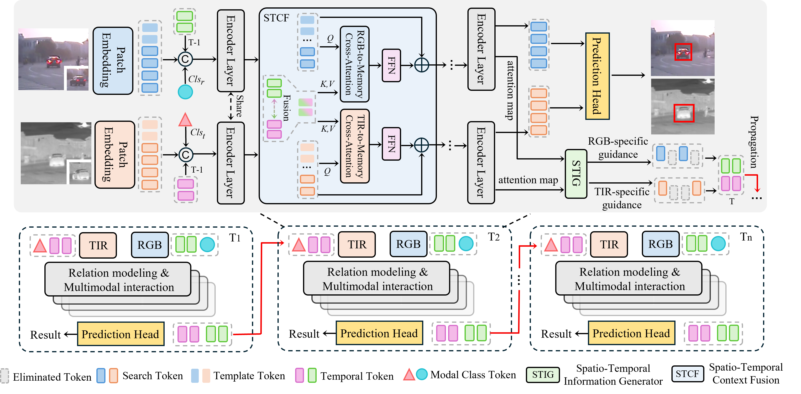

<h1 align="center">🎯 MOSSTrack: Modality-Specific Spatio-Temporal Context Learning for RGB-T Tracking </h1>

<div align="center">
  <a href="https://github.com/lyssyl157/MoSSTrack"><strong>MOSSTrack: Modality-Specific Spatio-Temporal Context Learning for RGB-T Tracking</strong></a><br>
  
  
  <strong>Yisong Liu</strong>, He Yao, Junlong Cheng, Yujie Lu, Junqi Bai, Min Zhu*<br>
  <a href="https://cvpr.thecvf.com/"><strong>CVPR 2026 Findings</strong></a>
</div>

<p align="justify">
This repository contains the official implementation of <strong>MOSSTrack</strong>. Unlike traditional methods that use identical spatio-temporal modeling for both modalities, MOSSTrack leverages <strong>modality-specific visual cues</strong> to guide the generation of feature-level spatio-temporal information. By integrating this generated information into feature representation learning and cross-modal fusion, MOSSTrack provides more accurate target references, maintaining stable performance in highly dynamic scenarios.
</p>

[[Models](https://drive.google.com/drive/folders/1ziMcFeHfY24GHCzz8GUH1Mk_MOk_p_Kf)], [[Raw Results](https://drive.google.com/drive/folders/1fHKotkqrFIgedJfRkDO2kC14HAlcYy1u)]

## 🚀 News
- 🎉 **[2026.03]** Our paper has been accepted by **CVPR 2026 Findings**!
- 📦 **[2026.04]** Training code, testing scripts, and configurations are officially released.

## ✨ Key Features & Contributions
<p align="center">
    
</p>


- **Spatio-Temporal Information Generator (STIG)**: Employs learnable modality-specific tokens to select representative visual features for each modality, establishing robust cross-frame spatio-temporal associations.
- **Spatio-Temporal Context Fusion (STCF)**: A simple yet effective module that leverages spatio-temporal cues to refine target-related features and facilitates efficient cross-modal interaction.
- **State-of-the-art Performance**: MOSSTrack achieves superior results on four challenging RGB-T tracking benchmarks, validating the effectiveness of modality-specific spatio-temporal modeling.

## ⚙️ Installation
Create and activate a Conda environment:
```
conda create -n MoSSTrack python=3.8
conda activate MoSSTrack
```

Install the required packages:
```
bash install.sh
```

## 📂 Data Preparation
Download the following datasets and place them under ./data/:

```
$<PATH_of_MOSSTrack>
-- data
    -- GTOT
        |-- BlackCar
        |-- Black5wan1
        ...
    -- RGBT210
        |-- afterrain
        |-- aftertree
        ...
    -- RGBT234
        |-- afterrain
        |-- aftertree
        ...
    -- LasHeR/train
        |-- 1boygo
        |-- 1handsth
        ...
    -- LasHeR/test
        |-- 1blackteacher
        |-- 1boycoming
        ...
    -- VTUAV/train
        |-- animal_002
        |-- bike_002
        ...
    -- VTUAV/test_ST
        |-- animal_001
        |-- bike_003
        ...
    -- VTUAV/test_LT
        |-- animal_003
        |-- animal_004
        ...
```

### Training
Dowmload the [pretrained model](https://drive.google.com/drive/folders/1UERkw6mLwg_kBJO1Og5DiEXHMNhZg3ZX) (DUTrack) 
and put it under ./pretrained_models/.
```
python tracking/train.py --script mosstrack --config mosstrack_256_full --save_dir ./output --mode multiple --nproc_per_node 2 --use_wandb 0
```

### Testing
[LasHeR & RGBT234 & VTUAVST] \
Modify the <DATASET_PATH> and <SAVE_PATH> in```./RGBT_workspace/test_rgbt_mgpus.py```, then run:
```
bash test_rgbt.sh
```
### Acknowledgment
- This repo is based on [ODTrack](https://github.com/GXNU-ZhongLab/ODTrack) and [DUTrack](https://github.com/GXNU-ZhongLab/DUTrack) which are excellent works.
- We thank for the [PyTracking](https://github.com/visionml/pytracking) library, which helps us to quickly implement our ideas.
